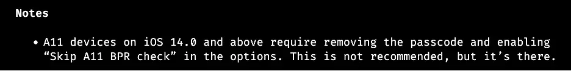
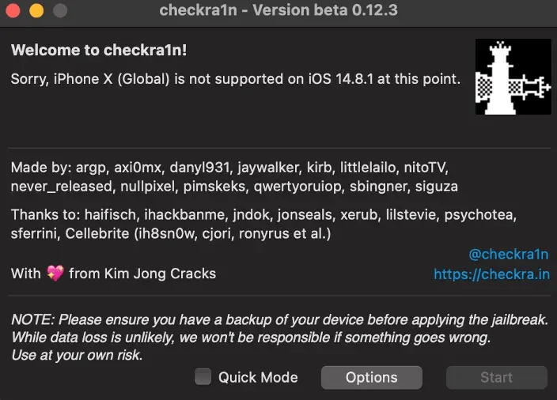

# Setting Up iOS Application Security Testing Environment

**Motivation**

When researching and doing penetration testing of the mobile application, I came across both major platforms Android and iOS. While it's quite easy to get started with Android, but it's not the same to do so on iOS due to some limitations from hardware and Apple's security features. This article will be the 1st chapter of a journey or a tale that will help you, and me to dive straight into iOS Security. It isn't a basic guideline, and it isn't a deep dive publication. Just a comprehensive note that collects snippets from many available blogs and resources to understand some interesting stuff besides how we find the issues.

Quickstart

Look back to the Android platform which has many options to choose the Android Virtual Device (AVD) or other emulators. While those emulators which fully emulate the hardware of an actual Android device, iOS can only offer Xcode’s Simulator which mimics the software environment not the hardware. Most importantly, emulator binaries are compiled to x86 code instead of ARM code. Apps compiled for a real device don’t run, making the simulator useless for black box analysis and reverse engineering.

[Here](https://roadfiresoftware.com/2015/04/will-an-ios-app-run-on-a-device-the-same-way-it-does-on-the-ios-simulator/) is an useful article which will explain the differences between a real device and the iOS simulator.

There is any iOS Emulator? Yes, [Corellium](https://www.corellium.com/). But it is an enterprise SaaS solution with a per user license model and does not offer any trial license. Hence, iOS app pentesting requires an actual iOS device and ensure the finding vulnerabilities are happening in the real devices.

\

#### Jailbreak 

**Why need to jailbreak**

Jailbreaking is the process of gaining root access to the entire device. The best approach for security testing an application is to examine it on a jailbroken device. Jailbreaking an iOS device allows for:

* Removing the security (and other) limitations on the OS imposed by Apple
* Providing root access to the operating system
* Allowing important testing software tools to be installed
* Providing access to the Objective-C Runtime

iOS applications store data in the application sandbox which is not accessible to the public (but is available to root and the application itself). Without root access, it is not possible to access the application sandbox, see what data is being stored, and how is it stored. Also, most the system level files are owned by root.

The process for jailbreaking various iOS versions can be quite different. Recommend:

* An A5-A11 iDevice (iPhone 5s to iPhone X)
* Use USB-A cable instead of USB-C because jailbreak have caused issues.

\
Warning:

* Jailbreaking your iDevice significantly weakens your security posture. You should not be doing this on your primary device. In fact, you should not use the jailbroken device for anything other than pentesting.
* If the iDevice is rebooted, jailbreak will lose. Hence, you need to jailbreak device again. Check different types of Jailbreak in [here](https://ios.cfw.guide/types-of-jailbreak/#what-are-the-different-types)

**Can I JailBreak ?**

_Please check the supported device and compatibility iOS version first._ [_Visit here._](https://canijailbreak.com/)

In this article, I will use the most popular jailbreak tool **Checkra1n** for example. Please refer to this [official website](https://checkra.in/) for newest details and updates.

Here it is Checkra1n Tool support Device list.

* iPhone 6s, 6s Plus, SE, 7 and 7 Plus
* iPad 5th, 6th and 7th generations
* iPad Air 2
* iPad mini 4
* iPad Pro 1st and 2nd generations
* iPod touch 7

A11 Support Device list:

* iPhone 8 and 8 Plus
* iPhone X

Unsupported devices: Checkra1n tool does not support A13 and A14 Jailbreak, such as iPhone 11 Pro, iPhone 11, iPhone 11 Pro Max, iPhone XR, iPhone XS Max, iPhone XS, iPhone XS Max, iPhone 12 / iPhone 12 Mini / iPhone 12 Pro / iPhone 12 Pro Max.

Notes: Checkra1n 0.12.3 version

**How can we jailbreak?**

Example:

* Checkra1n: 0.12.3 version
* MacOS Monterey
* iPhone X, version 14.8.1
* USB-A cable

**Step 1**. Remove Passcode in iPhone. Connect iPhone to Mac with a cable, then Click _“Trust”_ this computer.

<figure><figcaption></figcaption></figure>

**Step 3**. Open _Checkra1n_ tool, then config with option\

<figure><figcaption></figcaption></figure>

#### Network Setting 

To test web applications/API using an IOS device you need to configure your Burp/Zap Proxy listener to accept connections on all network interfaces, and then connect both your device and your computer to the same network.

**Step 1**. In Burp, go to “Proxy” tab > Option > Proxy Listeners Click Add and enter a port that is not currently in use (e.g 8081). Then choose apply for all interfaces/ or specific address with IP is your address of machine.

Notes: In some cases, you may need to disable TLS 1.3 due to some compatibility issues encountered during HTTPS URL testing.

**Why this works?**

Usually, when the iOS application establishes a TLS connection, it relies completely on the certificates came from Trust Store. They are trusted root certificates that are preinstalled with to iOS devices. Hence, with the self-signed certificate, an attacker can put this certificate into Trust Store and set up a man-in-the-middle attack.

**Prevent with SSL Pinning**

SSL Pinning is the process of associating a host with its certificate or public key. Once you know a host’s certificate or public key, you pin it to applicaiton.

Applications with SSL pinning are devised to reject some and accept some predefined certificates. When the app connects to a server, server checks the certificate with the pinned certificate. If the certificate on the server matches with the certificate pinned with the app, app will trust server and establishes an SSL connection. This enforcement ensures that the user devices are communicating only to the dedicated trustful servers.

**But … bypassing?**

The general idea for bypassing SSL pinning is determining the application programming language by analyzing the app binary.

1. The most and simple method is using [SSL Kill Switch 2](https://github.com/nabla-c0d3/ssl-kill-switch2) tool which is available on Cydia store. This will patch low-level functions responsible for handling SSL/TLS connections in order to override and disable the system’s default certificate validation, as well as any kind of custom certificate validation (such as certificate pinning).
2. The second method is using Frida toolkit. You can browse the bypass script and modify based on your iOS version. For example, you can use this [script](https://codeshare.frida.re/@machoreverser/ios12-ssl-bypass/) for bypassing SSL pinning on iOS 12.
3. Using built-in module in Objection
4. [Other methods](https://www.appknox.com/blog/bypass-ssl-pinning-in-ios-app). In some cases, all above methos may be not work due to the incompatible iOS version, custom Certificate Pinning mechanism, etc. You can try to Reverse Engineer the application and inject your own certificate, or entirely disable the calling classes and methods.

\

#### References: 

1. Will an iOS app run on a device the same way it does on the iOS simulator? - [https://roadfiresoftware.com/2015/04/will-an-ios-app-run-on-a-device-the-same-way-it-does-on-the-ios-simulator/](https://roadfiresoftware.com/2015/04/will-an-ios-app-run-on-a-device-the-same-way-it-does-on-the-ios-simulator/)
2. Can I Jailbreak - [https://canijailbreak.com/](https://canijailbreak.com/)
3. The iPhone Wiki - [https://www.theiphonewiki.com/](https://www.theiphonewiki.com/)
4. Jailbreak Reddit Community - [https://www.reddit.com/r/jailbreak/](https://www.reddit.com/r/jailbreak/)
5. OWASP Mobile Security Testing Guide - [https://mobile-security.gitbook.io/mobile-security-testing-guide/ios-testing-guide/0x06b-basic-security-testing#ios-testing-setup](https://mobile-security.gitbook.io/mobile-security-testing-guide/ios-testing-guide/0x06b-basic-security-testing#ios-testing-setup)
6. Configuring an iOS Device to Work With Burp - [https://portswigger.net/support/configuring-an-ios-device-to-work-with-burp](https://portswigger.net/support/configuring-an-ios-device-to-work-with-burp)
