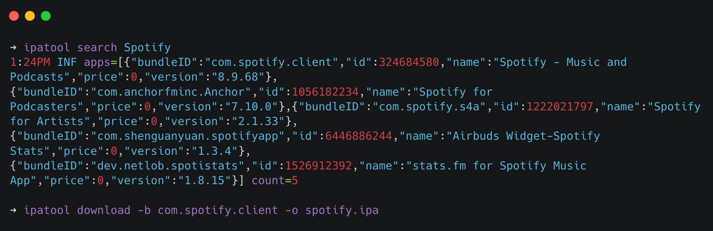

# Acquiring IPA File

The IPA file is required for various areas of mobile app examination and security. It contains the compiled program, as well as its executable, resources, and metadata, allowing for in-depth inspection and evaluation. Security professionals utilize the IPA file to conduct comprehensive security assessments, detecting potential vulnerabilities and flaws. It also enables reverse engineering to comprehend app behavior and identify hidden dangerous code.

In mobile security audits, clients and developers usually give the IPA file directly. They may email you the file directly or grant you access to their development-focused distribution channels, such as _TestFlight_ or _Visual Studio App Centre_.

If the app is available on the App Store, you must use some alternative ways to acquire IPA:



**Installation**:&#x20;

Via Homebrew

```
$ brew tap majd/repo
$ brew install ipatool
```

**Usage**:

Must use the Apple ID credential&#x20;

<figure><figcaption></figcaption></figure>

```
$ ipatool auth
$ ipatool search Spotify
$ ipatool download -b com.spotify.client -o spotify.ipa
```
