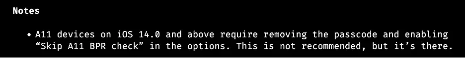
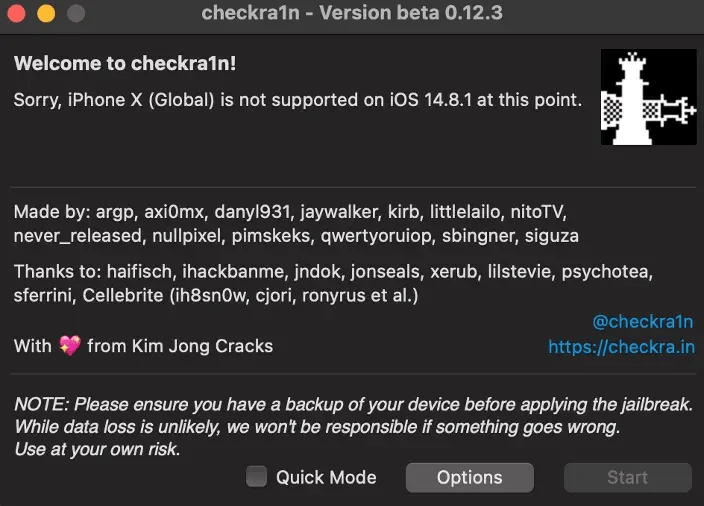
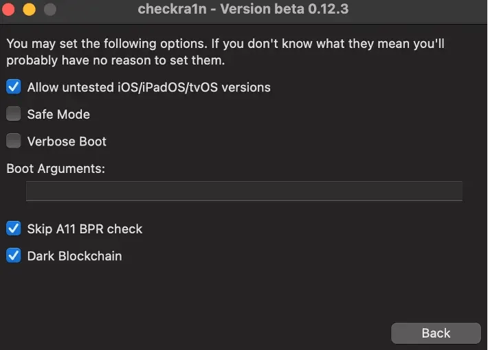
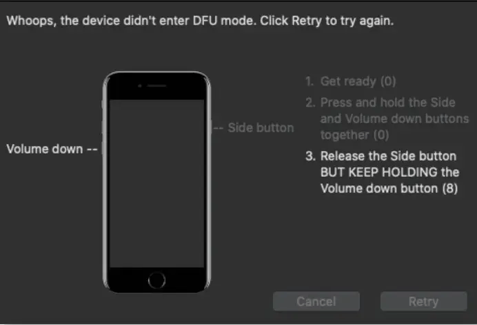
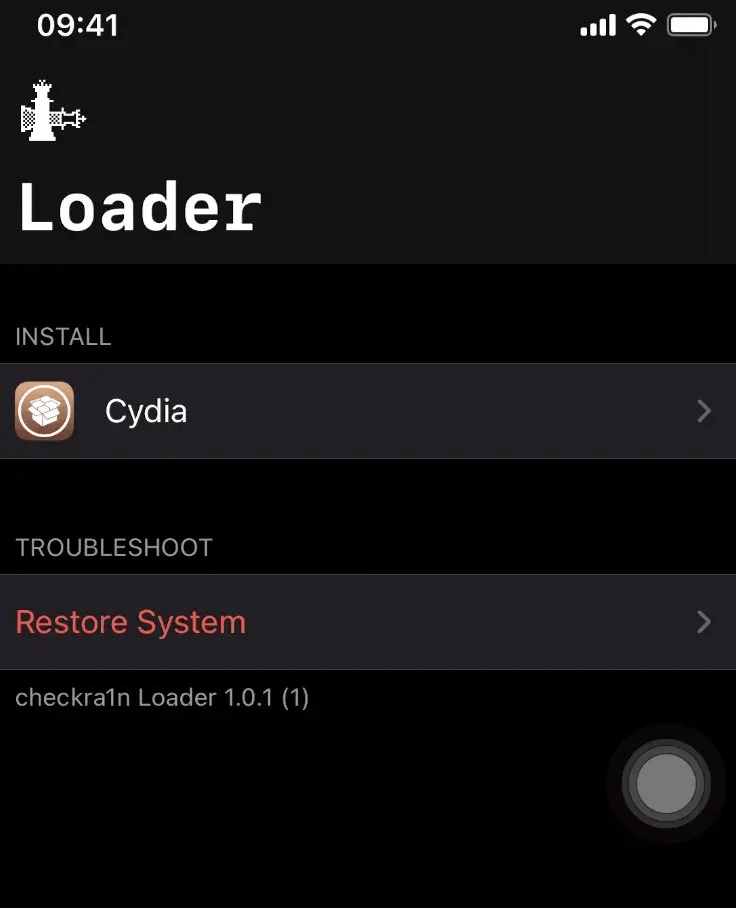

# Jailbreak Guide

###

The process for jailbreaking various iOS versions can be quite different.&#x20;

Recommend:

* An A5-A11 iDevice (iPhone 5s to iPhone X)
* Use USB-A cable instead of USB-C because jailbreak have caused issues.

### **Can I JailBreak?**

_Please check the supported device and compatibility iOS version first._ [_Visit here._](https://canijailbreak.com/)

In this article, I will use the most popular jailbreak tool **Checkra1n** for example. Please refer to this [official website](https://checkra.in/) for the newest details and updates.

Here it is the Checkra1n Tool support Device list.

* iPhone 6s, 6s Plus, SE, 7 and 7 Plus
* iPad 5th, 6th and 7th generations
* iPad Air 2
* iPad mini 4
* iPad Pro 1st and 2nd generations
* iPod touch 7

A11 Support Device list:

* iPhone 8 and 8 Plus
* iPhone X

Unsupported devices: Checkra1n tool does not support A13 and A14 Jailbreak, such as iPhone 11 Pro, iPhone 11, iPhone 11 Pro Max, iPhone XR, iPhone XS Max, iPhone XS, iPhone XS Max, iPhone 12 / iPhone 12 Mini / iPhone 12 Pro / iPhone 12 Pro Max.

Notes: Checkra1n 0.12.3 version

**How can we jailbreak?**

Example:

* Checkra1n: 0.12.3 version
* MacOS Monterey
* iPhone X, version 14.8.1
* USB-A cable

**Step 1**. Remove Passcode in iPhone. Connect iPhone to Mac with a cable, then Click _“Trust”_ this computer.

**Step 2**. Install Checkra1n tools on your Mac. In version 0.12.3, refer to the notes.

<figure><figcaption></figcaption></figure>

**Step 3**. Open _Checkra1n_ tool, then config with option\

<figure><figcaption></figcaption></figure>

<figure><figcaption></figcaption></figure>

**Step 4**. Enter the DFU mode, then follow instruction on screen

\

<figure><figcaption></figcaption></figure>

**Step 5**. Once booted, will have the installed Checkra1n application on iPhone. This means we jailbreak successfully. Finally, we can install Cydia inside Checkra1n app.\

<figure><figcaption></figcaption></figure>

1. Will an iOS app run on a device the same way it does on the iOS simulator? - [https://roadfiresoftware.com/2015/04/will-an-ios-app-run-on-a-device-the-same-way-it-does-on-the-ios-simulator/](https://roadfiresoftware.com/2015/04/will-an-ios-app-run-on-a-device-the-same-way-it-does-on-the-ios-simulator/)
2. Can I Jailbreak - [https://canijailbreak.com/](https://canijailbreak.com/)
3. The iPhone Wiki - [https://www.theiphonewiki.com/](https://www.theiphonewiki.com/)
4. Jailbreak Reddit Community - [https://www.reddit.com/r/jailbreak/](https://www.reddit.com/r/jailbreak/)
5. [https://ios.cfw.guide/](https://ios.cfw.guide/)
