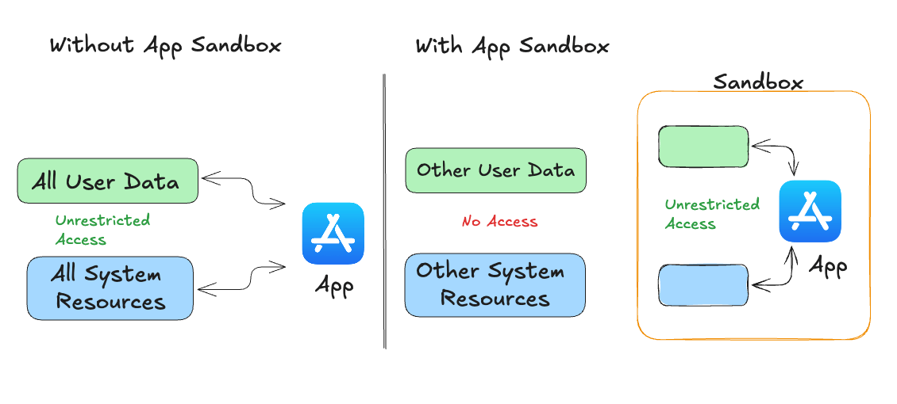
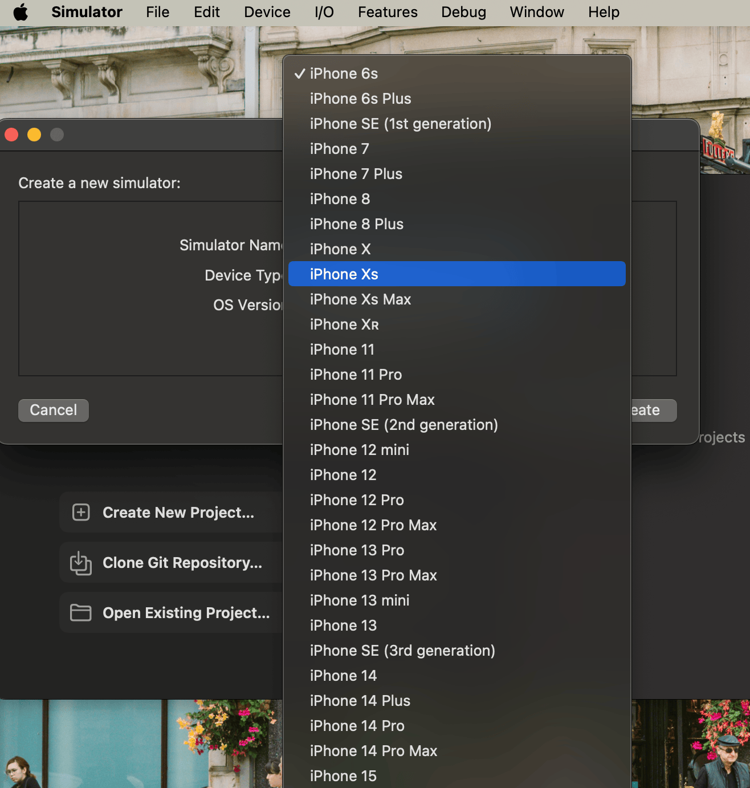
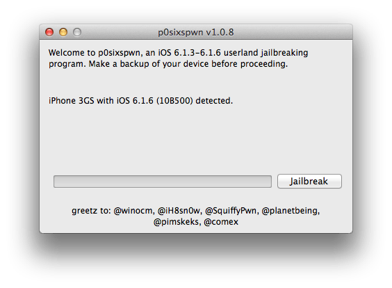
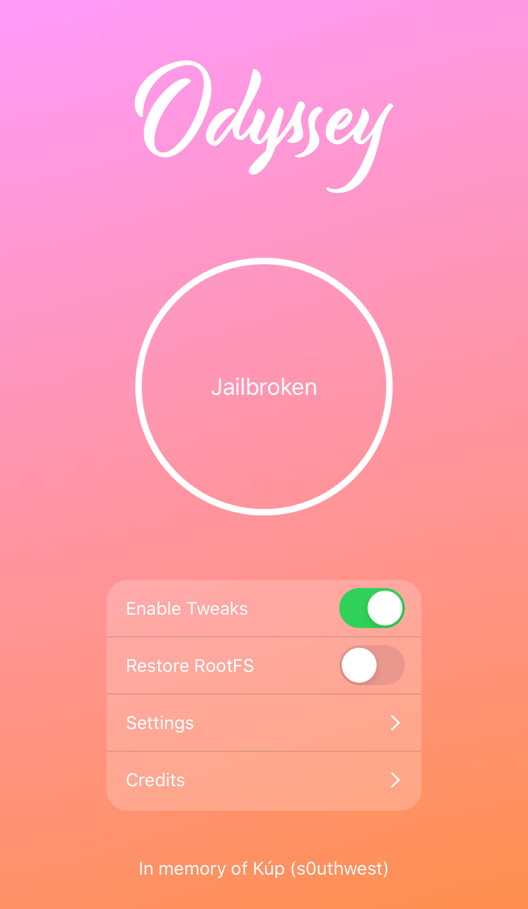
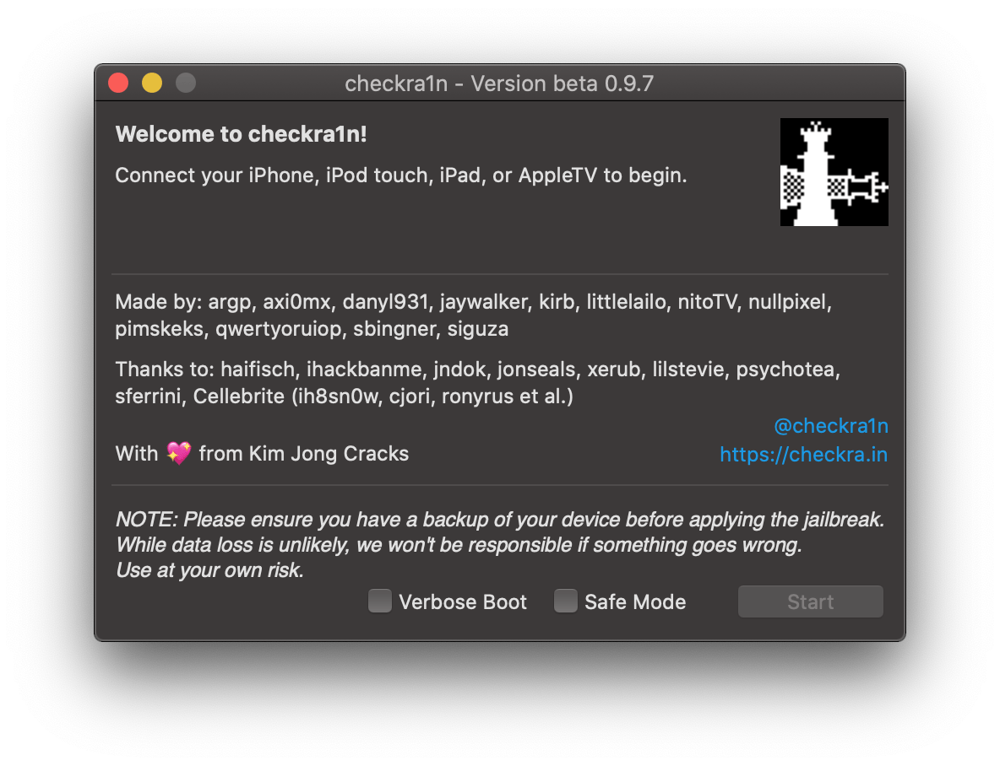

# Jailbreaking

## **Why Need to Jailbreak**

### Apple’s App Sandbox

On iOS, every app operates within its own sandbox, ensuring it can only access data stored in its unique home directory. If an app needs to access data outside its directory - like files in iCloud or photos - it must use specific iOS services. This sandboxing means that other apps can't read or alter your app's data, keeping it secure and isolated.

<figure><figcaption>
Fig 1. App Sandbox
</figcaption></figure>

Apple’s App Sandbox leverages UNIX user permissions to ensure apps run with the less privileged “_<mark style="color:red;">mobile</mark>_” user. Anything outside the app’s home directory is mounted as read-only.&#x20;

iOS includes robust measures to prevent memory-related security vulnerabilities. One key method is <mark style="color:red;">Address Space Layout Randomization (ASLR)</mark>, which randomizes the memory regions assigned to each app every time it starts. This makes it much harder for attackers to exploit memory corruption bugs. Additionally, memory pages are marked as non-executable using <mark style="color:red;">ARM’s Execute Never (XN)</mark> feature, which prevents malicious code from being executed

### **Benefits of Jailbreak**

Jailbreaking is about breaking free from the constraints imposed by Apple's App Sandbox and security features. It removes these limitations, allowing users to control their devices fully. This includes:

* Access to system files
* Installation of unauthorized apps
* Ability to tweak system settings that are normally restricted

In short, jailbreaking provides root access, enabling a level of customization and functionality that Apple's standard security doesn’t permit.

### Drawbacks


**Warning:** Jailbreaking your iDevice greatly compromises its security. It is not advisable to perform this on your primary device. A jailbroken device is for penetration testing only, not for regular use.


* **Security Vulnerabilities**: Bypassing Apple’s security can expose your device to malware and unauthorized access.
* **Stability Issues**: Jailbreaking may lead to system instability or crashes due to untested modifications.

### Run on a Real Device

Unlike Android, which offers a range of options like <mark style="color:red;">Android Virtual Device (AVD)</mark> and other emulators that replicate actual hardware, iOS only provides Xcode’s Simulator. This tool mimics the software environment but not the hardware, and it uses x86 code for emulator binaries instead of ARM code. As a result, apps compiled for real devices won't run on the simulator, making it ineffective for black box analysis and reverse engineering.

<figure><figcaption>
Fig 2. XCode Simulator
</figcaption></figure>

Is there an iOS emulator? Yes, <mark style="color:red;">Corellium</mark> is an option. However, it's an enterprise SaaS solution with a per-user license model and does not offer a trial version. Therefore, for effective iOS app penetration testing, using a real iOS device is necessary to accurately identify and address vulnerabilities.

[Here](https://roadfiresoftware.com/2015/04/will-an-ios-app-run-on-a-device-the-same-way-it-does-on-the-ios-simulator/) is a useful article which will explain the differences between a real device and the iOS simulator. In short, here’s a summary of the key differences between testing an iOS app on the simulator versus a real device:

* **Compilation Differences**: Code is compiled for x86 architecture on the simulator and ARM architecture on real devices, meaning the compiled code you test in the simulator isn't the same as what runs on a device.
* **API Limitations**: Certain APIs, such as those for push notifications, camera, and microphone, aren't available in the simulator. Testing these features requires a real device.
* **Performance Constraints**: Real devices have less memory, storage, and processing power compared to the simulator. This can lead to noticeable performance differences, especially with resource-intensive tasks.
* **Interaction Differences**: Clicking on the simulator is different from tapping on a real device. Buttons that are easy to click on the simulator may be difficult to tap on a real device, affecting usability.
* **Gesture Testing**: Testing gestures like pinches and swipes are more challenging with a mouse pointer in the simulator than with actual fingers on a real device.

## Types of Jailbreak 

Not all jailbreaks work in the same way. This page will take you through each type of jailbreak and explain how they work.

(This section is copied from [ios.cfw.guide](https://ios.cfw.guide/))

### 1. Untethered Jailbreaks

Untethered jailbreaks can be considered the holy grail of all jailbreaks. They only require the exploit to be ran once either via a website, an app or a computer.

<figure><figcaption>
Fig 3. p0sixspwn
</figcaption></figure>

After that, your device is fully jailbroken and won't require any further action. The exploit will stay on a device even after you reboot it.

Unfortunately, there hasn't been a new untethered jailbreak for end users in a very long time, and it's likely we won't see one for even longer.

The only downside to an untethered jailbreak is that if something goes wrong, it could very well result in a bootloop requiring you to restore your device via iTunes or Finder (macOS Catalina or newer). The likelihood of this happening is _low_, but is indeed possible.

A few examples of untethered jailbreaks are [p0sixspwn](https://ios.cfw.guide/installing-p0sixspwn) and Pangu9.

### 2. Semi-Untethered Jailbreaks

Semi-untethered jailbreaks have been the most popular type of jailbreak in recent years. This type of jailbreak requires an exploit to be executed every time you reboot or turn off your device.

<figure><figcaption>
Fig 4. Odyssey
</figcaption></figure>

This jailbreak works by running the exploit through an app or website on the device itself. Due to the nature of how the exploit is ran, however, these jailbreaks are easily removable through their respective app.

A few examples of semi-untethered jailbreaks include [Taurine](https://ios.cfw.guide/installing-taurine), [Dopamine](https://ios.cfw.guide/installing-dopamine), and [Odyssey](https://ios.cfw.guide/installing-odyssey).

### 3. Semi-Tethered Jailbreaks

Semi-tethered jailbreaks are very similar to semi-untethered jailbreaks, however the exploit must be ran using a computer rather than using a sideloaded app.

<figure><figcaption></figcaption></figure>

Due to requiring a computer to rejailbreak after every reboot, most choose to use a semi-untethered jailbreak instead.

A few examples of a semi-tethered jailbreak include [palera1n](https://ios.cfw.guide/installing-palera1n) and [Odysseyra1n](https://ios.cfw.guide/installing-odysseyra1n).

### 4. Tethered Jailbreaks

Tethered jailbreaks are not meant to be used by the general public. These exploits modify the device in a way that it requires a PC to even boot at all, even without a jailbreak.

Because of this, these tend to only be used by jailbreak developers getting ready for a newer version of iOS.

## References:

1. [https://quickbirdstudios.com/blog/ios-app-security-best-practices/](https://quickbirdstudios.com/blog/ios-app-security-best-practices/)
2. [https://support.apple.com/en-vn/guide/security/sec15bfe098e/web](https://support.apple.com/en-vn/guide/security/sec15bfe098e/web)
3. [https://ios.cfw.guide/types-of-jailbreak/](https://ios.cfw.guide/types-of-jailbreak/)
4. [https://roadfiresoftware.com/2015/04/will-an-ios-app-run-on-a-device-the-same-way-it-does-on-the-ios-simulator/](https://roadfiresoftware.com/2015/04/will-an-ios-app-run-on-a-device-the-same-way-it-does-on-the-ios-simulator/)
