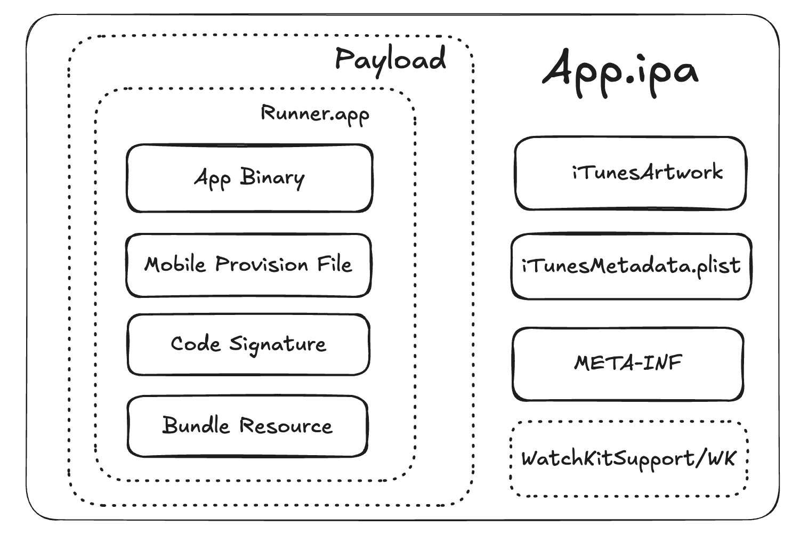
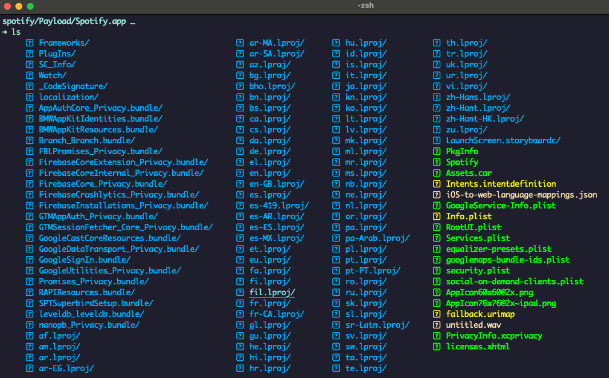
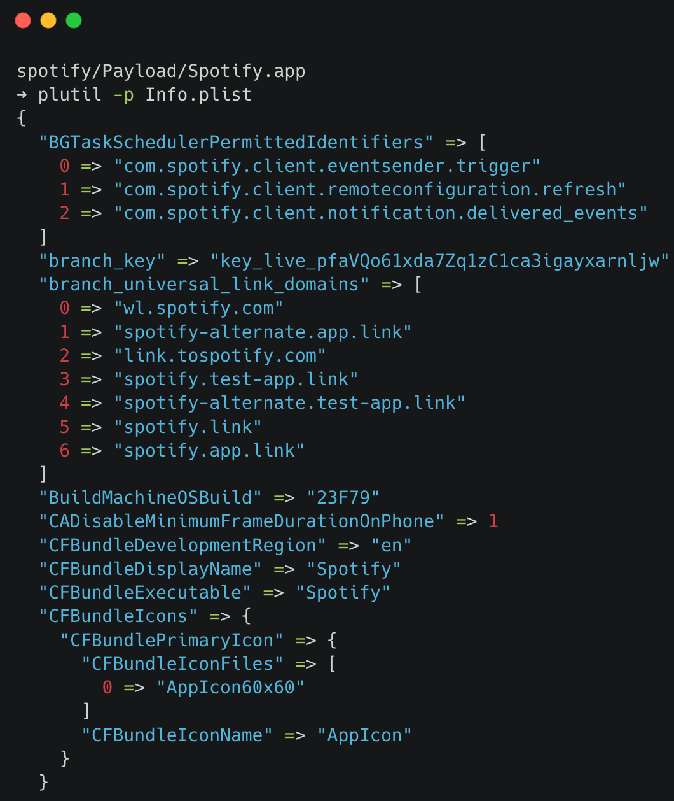
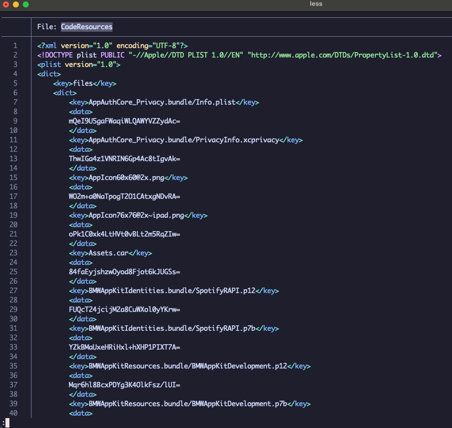
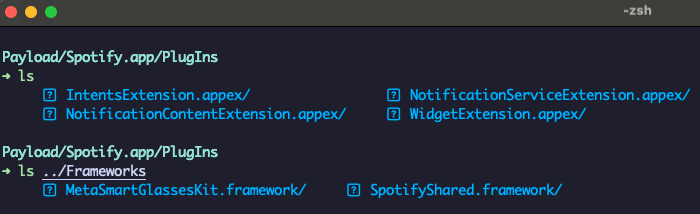
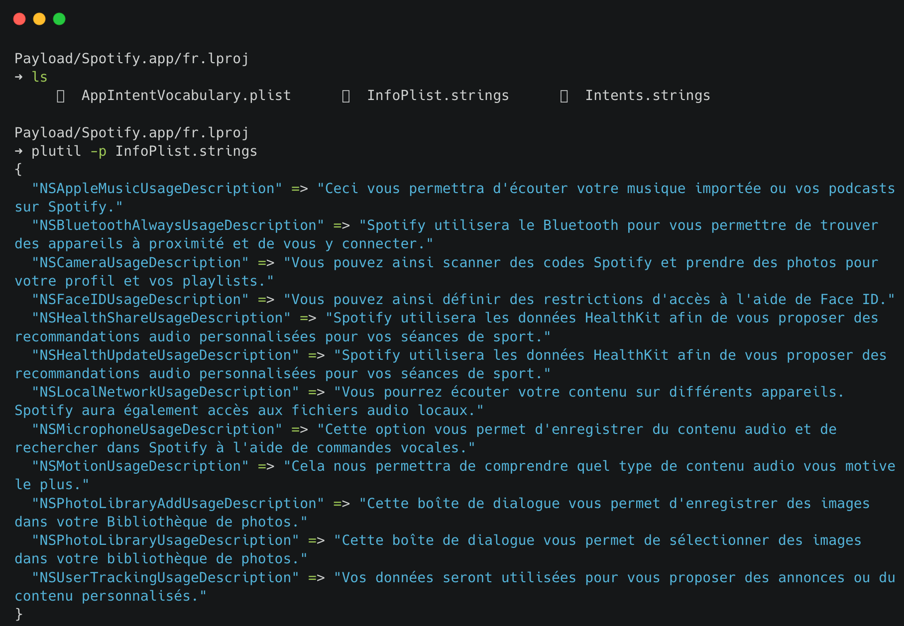

# IPA (iOS AppStore Package)

### **1. IPA File Structure**

iOS apps are distributed in IPA (iOS App Store Package) archives, which are ZIP-compressed files containing the app's binary, resources, and metadata needed to execute on iOS devices. Similar to Android's APK, IPA files are specific to Apple's iOS devices and are used to install apps on iPhones, iPads, and iPods.

<figure><figcaption>
Fig 1. IPA Structure
</figcaption></figure>

<table><thead><tr><th width="251">Name</th><th>Description</th></tr></thead><tbody><tr><td>iTunesArtwork</td><td>A 512x512 pixel PNG image used as app’s icon that shows up on iTunes, and App Store.</td></tr><tr><td>iTunesMetadata.plist</td><td>A property list file that contains developer information like developer name, ID, copyright information, application name, release information, etc.</td></tr><tr><td>META-INF</td><td>
Subdirectory within the IPA file stores meta-information used by the application during open IPA file creation. 

Under the META-INF/ folder, you will find two more files:
<ul><li>com.apple.FixedZipMetadata.bin</li><li>com.apple.ZipMetadata.plist</li></ul></td></tr><tr><td>WatchKitSupport/WK</td><td>The WatchKit framework simplifies app development for watchOS apps, including managing background tasks, extended runtime sessions, Siri intents, and accessing user information about Apple Watch within the IPA system.</td></tr><tr><td>Payload</td><td>Folder that contains the application data.</td></tr><tr><td>Application Binary</td><td>The executable file containing the application’s code. Same name with actual application name. The complete binary analysis is performed on this application binary.</td></tr><tr><td>Mobile Provision file</td><td>By default, applications on iOS can only installed via AppStore. In some special cases, when the app is to be beta tested, mobile provision certificates are generated and used. This is the file which is included in the binary when ad hoc distribution of the file is to be </td></tr><tr><td>Code Signature</td><td>Check the integrity of the app when the application was released. Any kind of editing or deletion will invalidate the signature. Any changes that are made to the .app file require that the whole package be re-signed.</td></tr><tr><td>Bundled Resource Files</td><td>Images, Videos, Sounds, HTML, Property list files, etc. which are required by the application to be installed on the mobile device.</td></tr></tbody></table>

### **2. Payload: A Closer Look**

In the Payload folder, you'll find a .app folder representing the app's name. Inside, all app data is stored.&#x20;

For example: Spotify app

<figure><figcaption>
Fig 2. Spotify IPA sample
</figcaption></figure>

* **Info.plist**: Configuration information, such as bundle ID, version number, and application display name

<figure><figcaption>
Fig 3. Info.plist sample
</figcaption></figure>

* **\_CodeSignature/**CodeResources**:** includes a plist file that contains a signature, ensuring the integrity of all files in the bundle.

<figure><figcaption>
Fig 4. CodeSignature sample
</figcaption></figure>

* **Assets.car:** A compressed archive is used to store asset files, such as icons.
* **Frameworks:** contains the app native libraries as .dylib or .framework files
* **PlugIns**: may contain app extensions as .appex files

<figure><figcaption>
Fig 5. Frameworks and PlgIns directory
</figcaption></figure>

* Multiple .lproj folders represent languages, each containing a Localizable.strings file in XML format for localization. (en.lproj, fr.lproj, etc )

<figure><figcaption>
Fig 6. fr.lproj sample
</figcaption></figure>

* [**`PkgInfo`**](https://developer.apple.com/library/archive/documentation/MacOSX/Conceptual/BPRuntimeConfig/Articles/ConfigApplications.html): The `PkgInfo` file is an alternate way to specify the type and creator codes of your application or bundle. The contents of the `PkgInfo` file are the 4-byte package type followed by the 4-byte signature of your application. Thus, for the TextEdit application, whose type is `'APPL'` and whose signature is `'ttxt'`, the file would contain the ASCII string “APPLttxt”.
*   **SC\_Info:** This folder contains keys which are used for decrypting the app executables. The contents will look like this:

    * Manifest.plist
    * Spotify.sinf&#x20;
    * Spotify.supf&#x20;
    * Spotify.supp
    * Spotify.supx

    The _.sinf, .supf, .supp, .supx_ files are used for decrypting, and the _Manifest.plist_ file is used to list all of the relevant _.sinf_ files which are to be used.&#x20;
* **\<name>.storyboardc/:** contain some information on the layout of specific panels or views in the app. The inclusion of these folders suggests that the app was created with the Interface Builder tool. Several.nib files and an additional Info.plist file can be found in these folders.
  * Info.plist
  * 01J-lp-oVM-view-MkI-aN-x20.nib&#x20;
  * UIViewController-01J-lp-oVM.nib

### Reference:

1. [https://developer.apple.com/library/archive/documentation/FileManagement/Conceptual/FileSystemProgrammingGuide/FileSystemOverview/FileSystemOverview.html](https://developer.apple.com/library/archive/documentation/FileManagement/Conceptual/FileSystemProgrammingGuide/FileSystemOverview/FileSystemOverview.html)
2. [https://mas.owasp.org/MASTG/0x06a-Platform-Overview/#apps-on-ios](https://mas.owasp.org/MASTG/0x06a-Platform-Overview/#apps-on-ios)

