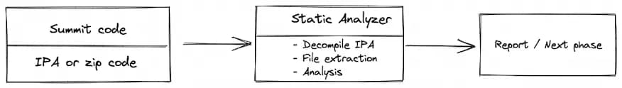

# 🎨 Static Analysis


**Good to know:** depending on the product you're building, it can be useful to explicitly document use cases. Got a product that can be used by a bunch of people in different ways? Maybe consider splitting it out!


## Figma Integrations

In this article, we continue with SAST that is the next phase after getting the IPA package. **Static Application Analysis Testing (SAST)** is a testing methodology to analyze the source code without executing and it detects the security issues based on code patterns.

There are some approaches to use when doing the **SAST**. While the automated scans catch the low-hanging fruits and the manual code review will cost much time and human effort, the hybird which is a combination of both approaches should be use, but this process is still tedious and time-consuming.

* **Manual code review**: analyzing manually the application’s source code. It can use some keywords, patterns to detect the unsecure functions or some extensions which avalable on IDEs like (Linter, sanitizer, AST tool). Manual review is good for finding business logic flaws, design flaws. This requires a test reviewer who is proficient in the language and frameworks in use, and understanding the data flow.
* **Automated analysis**: using atomated tools to speed up the review process. They check the source code for compliance with a predefined set of rules or industry best practices, then typically display a list of findings or warnings and flags for all detected violations.

**Static analysis in Penetration Testing**

If we are joining an in-house project, and having source code, hence we can easily do manual code review without efforts to reverse code. But if we are doing black-box testing aka penetration testing and just have an application binary file, we could do more to achieve more understanding about the application.

Static analysis is the first step to get overview of the application including the framework, the using services. It can also help detect some potential vulnerabilities before running like hard-coded sensitive data, misconfigurations or possible vulnerable functions …

<figure><figcaption></figcaption></figure>

**2. Common Flaws**

Plist file (property file) is a structured text file that contains metadata about the app which are essential for the app to run. Plist file are collections of key-value pairs (such as a dictionary list) that specify how the system should interpret the associated bundle. Some key-value pairs characterize the bundle itself, while others configure the app, framework, or other entity that the bundle represents. Some keys are required, while others are specific to particular features of the executable.

* An iOS app can have multiple plists file (at least one file for example: Info.plist the default property list supplied by Xcode when you create a project).
* Can stored in binary or XML format. Can open with Xcode or cli tool (plutil, plistutil).

From the plist, we can garther some basic information about the application like: version, display name, bundle Id, MinimumOSVersion, Permissions ( `NS<feature>UsageDescription`), Application Transport Security (ATS, `NSAppTransportSecurity`).

Misconfiguration may lead to expose sensitive data in Plist file like:

* Custom URL schemes: Applications can use custom URLs to communicate each other via a custom protocol. URIs in schemes can be registered without validation that allows sensitive information sends via this insecure URI and leads to further attacks.
* API or hardcoded credential exposed
* Internal Path: Developer may left some internal paths that could provide some information about their computers.
* Misconfigured ATS settings.

**2.2. Excessive app permissions**

In contrast to Android, where each app runs on its own user ID, iOS makes all third-party apps run under the non-privileged mobile user. Each app has a unique home directory and is sandboxed, so that they cannot access protected system resources or files stored by the system or by other apps. These restrictions are implemented via sandbox policies (aka. profiles), which are enforced by the MAC (Mandatory access control framework) via a kernel extension. iOS applies a generic sandbox profile to all third-party apps called container.

Some permissions can be configured by the app’s developers (e.g. Data Protection or Keychain Sharing) and will directly take effect after the installation. However, for others, the user will be explicitly asked the first time the app attempts to access a protected resource: Camera, Contacts, HomeKit, Location, Microphone, Music and the media library …

But sometimes, application may request access to personal information that they don’t actually need for the app to function. It might be used to tailor personalized user experiences and refining app performance. But they might also want to monetize user data by reselling it to 3rd advertising data brokers without your knowledge.

Developers need to evaluate their data collection practices to minimize potential privacy impacts, and users need to be aware of the privacy that they are giving up when they allow apps to access data and systems.

**Evaluating app permission:**

* View list of app permissions on Info.plist and in MobSF dashboard.
* Determine which permission is necessary or not based on description of usage and type of application.
* Avoid some permissions o Access to many photos o Unlimited camera access o Unlimited location access o Stealth microphone access o Inappropriate cross-app data sharing.

**Recommendations:** To minimize the risk of having your sensitive information exposed to unwanted parties:

* Read permissions carefully when they pop up. Ask yourself: does this app need access to the private data to function? For example, if a weather app is asking for access to your camera or contact library, think twice before accepting, and don’t hesitate to deny access to requests that you don’t understand or don’t agree with.
* Regularly audit your app permission settings to see which apps are accessing what on your device. Things to look for: o (1) apps you no longer use (consider deleting them but if you cannot, remove the permission to sensitive data); o (2) apps that are in the news (has there been a burst of privacy activity?).
* When it comes to location data, always grant permission ‘only while in use’ — which is available on both iOS and Android.
* Delete apps you no longer use to minimize the risk of bugs appearing in old or abandoned apps. There are features available on both iOS and Android to offload/delete unused apps.

**2.3. App Transport Security (ATS)**

ATS protection enforces the comunication between the backend the application is secure. It prevents accidental leakage of sensitive data by allowing the app to use TLS v1.2 and rejecting HTTP connections. ATS is controled by `NSAllowArbitraryLoads` which is set to NO by default. If this key is set to YES in Info.plist, this will disable ATS and its security.\
In Objective C, some APIs like strlen, memcpy, strcpy etc have been deprecated as they might lead to memory corruption like Buffer Overflow. If an attacker is able to find entry points to these functions, he can try to send malicious inputs at run-time and try to exploit th vulnerability. Hence, these functions are considered not to use them.

APIs like \_rand, \_srand and \_random are considered insecure for generating random numbers as the results can be predicted by an attacker. If they are being used to generate random numbers for sensitive information, an attacker can try to predict the random numbers and try to play malicious behaviour in the application. The attack complexity is very high and also many times developers combine these APIs with cryptographically strong APIs. So the vulnerability falls under the informational category

When using NSLog, the log messages are stored with default log level persistently for a certain time, which was tested with iOS 12.4, iOS 13.3 and 13.4 on non-jailbroken devices. Depending on the usage intensity of the iOS device, the stored log messages can go back days or months.

\
Replace malloc, with calloc function, but base on the usage and performance of using this function, it will be mark to information category.

**3.5. Use weak hashing algorithms**

APIs like MD5 and SHA1 are considered weak hashing algorithms due to collision issues. They can be cracked using websites using large databases or using a tool like hashcat.

**4. Application runtime protection features**

There are 3 technologies that are used to prevent buffer overflows

* Address Space Layout Randomization (ASLR)
* Automatic Reference Counting (ARC)
* Stack Protectors

\
**4.1. Address space layout randomization (ASLR) & PIE**

ASLR is an important exploit mitigation technique introduced in iOS 4.3. ASLR makes the remote exploitation of memory corruption vulnerabilities significantly more difficult by randomizing the application objects’ location in the memory. By default, iOS applications use limited ASLR and only randomize part of the objects in the memory.

It is implemented by compiling iOS application binary with PIE (Position Independent Executable) flag.

If ASLR is not enabled for an iOS application, offsetting of the location of modules and certain in-memory structures would not take place randomly and will hence open a gate for Buffer Overflow attack.

Each time you run a “Position Independent Executable” (PIE), the binary and all of its dependencies are loaded into random locations within virtual memory, which make ROP attacks much more difficult to execute reliably.

We can check for the presence of the PIE flag in our executable with otool.\
Then, check that these flags are set:

* In Other C flags: `-fPIC`
* In Other Warning flags: `-Wl,--emit-relocs` (retains all relocations in the executable file) and `-Wl --warn-shared-textrel` (warns if the text segment is not shareable)

**4.2. Automatic Reference Counting (ARC)**

ARC is a feature of the Clang compiler which is exploit mitigation technique introduced in iOS 5; it automatically frees up the memory used by class instances when those instances are no longer needed. It protects applications from memory corruption vulnerabilities by moving the responsibility of memory management from the developer to the compiler. ARC can be enabled in an application within XCode by setting the compiler option `“Objective-C Automatic Reference Counting”` to “yes”. By default it is marked as “yes”.

**4.3. Stack smashing protection**

Stack smashing protection is an exploit mitigation technique that protects against stack overflow attacks by placing a random value known as stack canary before local variables on stack. The stack canary is checked upon return of the function. In case of an overflow, the canary is corrupted, and the application is able to detect and protect against the overflow. In order to take advantage of the stack smashing protection, the application should be compiled with the –fstack-protector-all flag.

Stack-smashing protection is implied to an iOS application by placing a known value or “canary” on the stack directly before the local variables to protect the saved base pointer, saved instruction pointer, and function arguments. The value of canary is checked on the event of function return and is reported if there is any change.

If the stack smashing protection is not enabled, the attacker would try to insert malicious payloads in the application and hence leading to the crashing of the application at run-time making the user experience for the application bad. The vulnerability is difficult to attack but not impossible.

**4.4. Rpath**

The “Runpath Search Path” instructs the dynamic linker to search for a dynamic library (dylib) on an ordered list of paths … sort of like how Unix looks for binaries on $PATH. This is an issue because it makes it possible for an attacker to place a malicious dylib in one of the first paths that doesn’t contain the library that the linker is trying to locate, therefore hijacking it.

**4.5. NX**

NX bit is specific to non-executable memory pages. Default protection is provided by iOS using ARM’s Execute Never (XN).

**4.6. Symbols Stripped**

When Xcode compiles your source code into machine code, it generates a list of symbols in your app—class names, global variables, and method and function names. These symbols correspond to the file and line numbers where they’re defined; this association creates a debug symbol, so you can use the debugger in Xcode, or refer to line numbers reported by a crash report.

Debug builds of an app place the debug symbols inside the compiled binary file by default, while release builds of an app place the debug symbols in a companion Debug Symbol file (dSYM) to reduce the size of the distributed app.

If MobSF flags you project as containing debug symbols, please ensure that your project’s “Build Settings” contain the following “Release” configurations:

* `Deployment Postprocessing = YES;`
* `Strip Debug Symbols During Copy = YES;`
* `Strip Linked Product = YES;`
* `Strip Style = All Symbols;`
* `Strip Swift Symbols = YES`

App Store binaries are signed by both their developer and Apple. This encrypts the binary so that decryption keys are needed in order to make the binary readable.

* If download app from the Appstore, the binary is encrypted
* Download ipa from other source, might be not encrypted

Check this in MobSF or otool. If cryptid is a 0 value, the binary is not encrypted.

Code signing is simply the process of signing an application with an appropriate certificate that ensures the author’s identity and the app content’s integrity.
